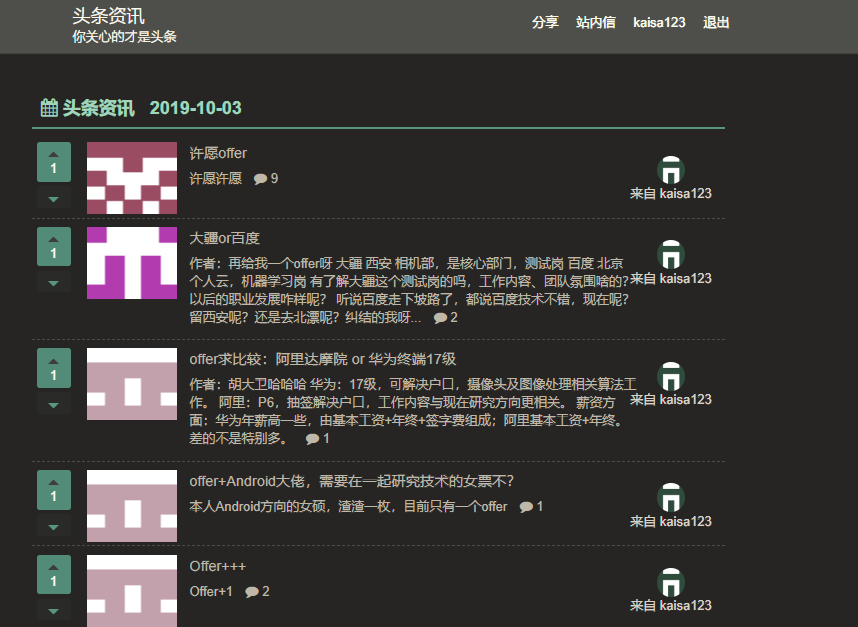
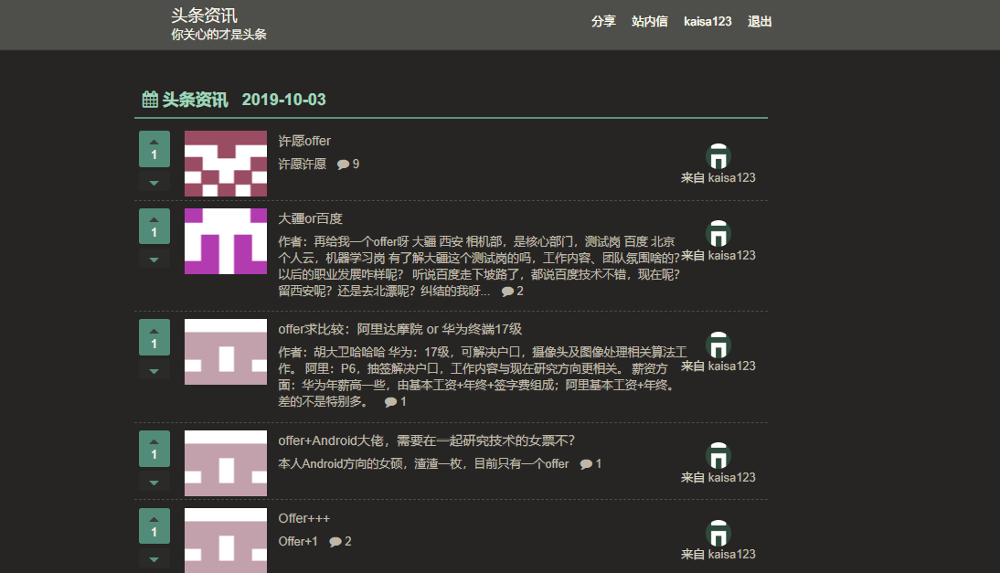

#### 
项目简介： 项目主要用于为用户提供资讯发布，资讯查看，资讯评论，站内信查看，对资讯进行点踩赞，trie树进行敏感词过滤，点赞进行站内信通知
***
+ ***项目技术点***
  + MD5算法对用户密码进行加密，拦截器从Cookie中取出ticket判断用户的登录状态、ThreadLocal保存登录用户的信息、引入PageHelper分页插件实现资讯的分页查看、发布问题时检查标题和内容以及评论，防止 xss 注入、并且使用trie树过滤敏感词、使用集成Mybatis操作数据库、使用Redis实现点踩赞功能
***
+ ***开发环境***
   +  IntelliJ IDEA, Java、Spring Boot、Tomcat、MySQL、Redis
***
- *功能简介*
  -    用户注册登录，分享资讯、分页查看资讯、查看资讯的评论、站内信查看删除、分页查看用户个人发帖情况、对发布的内容进行敏感词过滤、Redis实现用户对资讯进行点踩赞,点赞异步进行站内信通知,有效提高了响应速度,优化了用户体验

### 部分截图
###### 资讯首页

##### 资讯详情页

##### 用户发帖首页

##### 站内信

